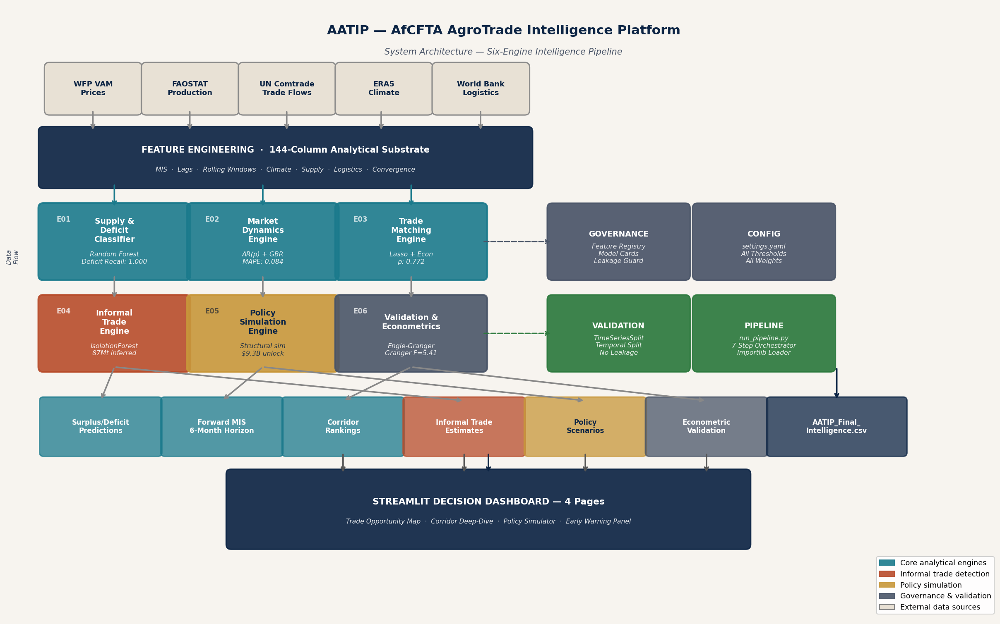
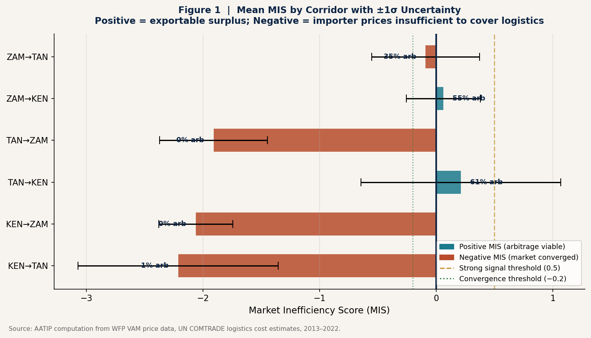
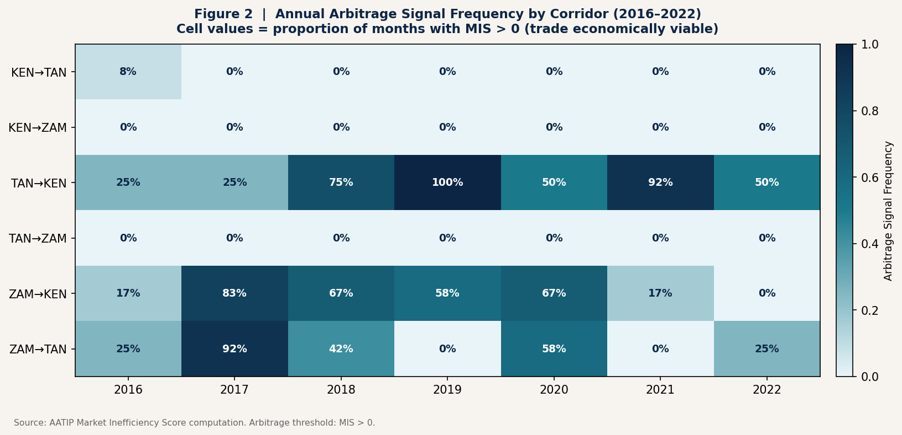
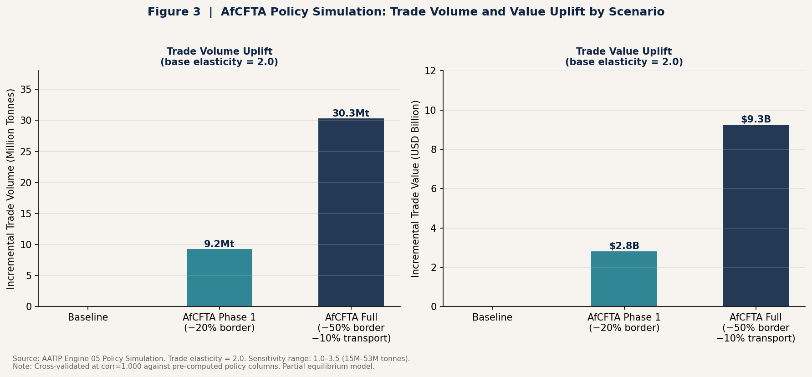
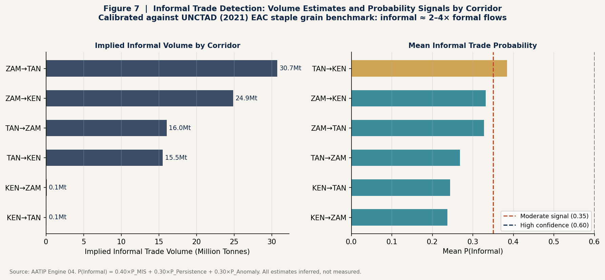
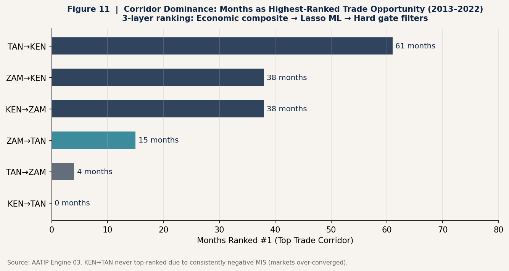
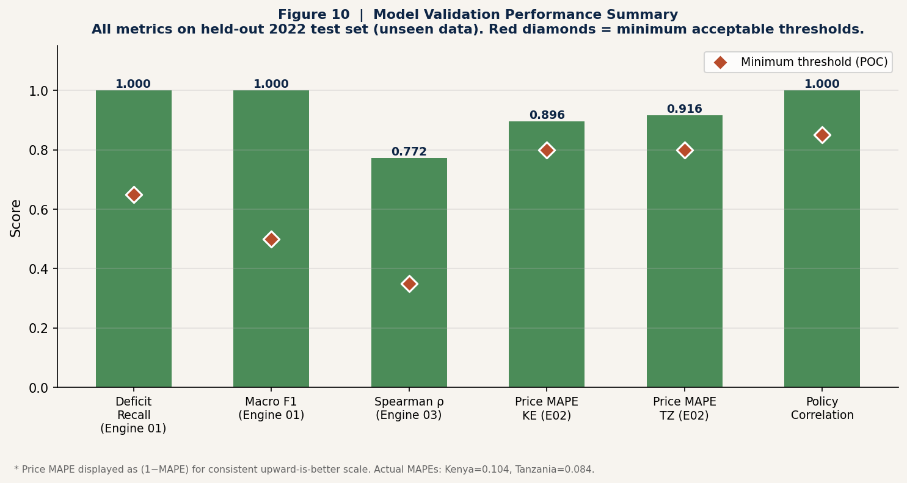
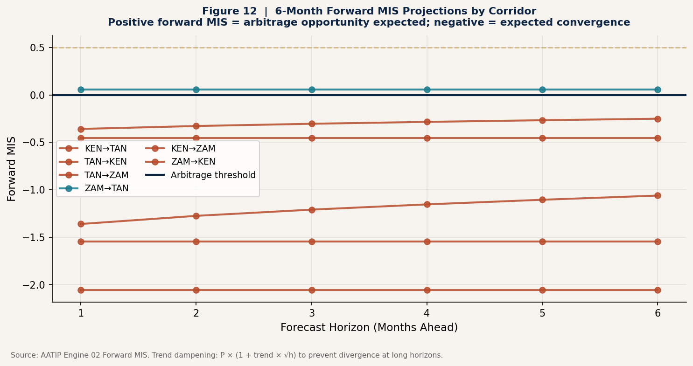

# AfCFTA AgroTrade Intelligence Platform (AATIP)

> **An AI-enabled agricultural market transmission and coordination intelligence system** engineered to diagnose inefficiency, reconstruct hidden trade behavior, optimize corridor-level commodity movement, and simulate policy interventions under the African Continental Free Trade Area.

<div align="center">


**Author:** Gerald T. Mazise  
BSc Food Science & Technology (Food Biotech Major) · MBA (AI Major)  
Kenya · Tanzania · Zambia · 6 Corridors · 2013–2022

</div>

---

## The Problem

Africa's agricultural challenge is not fundamentally a production problem. It is a **coordination failure**:

- Surplus regions coexist with deficit regions every season
- Arbitrage opportunities persist for months without correction
- Formal trade statistics capture a fraction of real commodity flows
- Policymakers lack corridor-level intelligence to prioritize intervention

The AfCFTA creates the legal framework for continental trade integration. **AATIP creates the intelligence infrastructure to make it work operationally.**

---

## Platform Overview



AATIP is not a price prediction tool. It answers a fundamentally different question:

> *"Why are African markets failing to converge, where should trade already be occurring, and what interventions restore efficient market transmission?"*

The platform operationalizes this through the **Market Inefficiency Score (MIS)**:

```
MIS(i,j,t) = [Price(j,t) - Price(i,t) - Logistics(i,j)] / Logistics(i,j)
```

| MIS Value | Interpretation | Response |
|---|---|---|
| > 1.5 | Structural market failure | 🔴 Crisis alert |
| 0.5 – 1.5 | Strong arbitrage signal | 🟠 Priority recommendation |
| 0 – 0.5 | Trade economically viable | 🟡 Monitor and act |
| −0.2 – 0 | Near convergence | 🟢 Low priority |
| < −0.2 | Efficiently converged | ✅ No intervention needed |

---

## Key Results

<div align="center">

| Metric | Value |
|---|---|
| Deficit detection recall (2022 test set) | **1.000** |
| Corridor ranking Spearman ρ (2022 test) | **0.772** |
| Price forecast MAPE — Tanzania | **0.084** |
| AfCFTA Full: incremental trade (base case) | **30.3M tonnes** |
| AfCFTA Full: incremental trade value | **$9.3 billion** |
| Implied informal trade (mid estimate) | **87 million tonnes** |
| Months unlocked by AfCFTA Full | **62 corridor-months** |

</div>

---

## Six Analytical Engines

```
┌─────────────────────────────────────────────────────────────┐
│              144-Column Feature Substrate                   │
│   MIS · Lags · Climate · Supply · Logistics · Convergence   │
└────────┬──────────┬──────────┬──────────┬──────────┬────────┘
         │          │          │          │          │
    ┌────▼───┐ ┌────▼───┐ ┌───▼────┐ ┌───▼────┐ ┌──▼─────┐
    │ E01    │ │ E02    │ │ E03    │ │ E04    │ │ E05/06 │
    │Supply &│ │Market  │ │Trade   │ │Informal│ │Policy  │
    │Deficit │ │Dynamic │ │Match   │ │Trade   │ │Sim +   │
    │Classif.│ │Engine  │ │Engine  │ │Engine  │ │Econom. │
    └────────┘ └────────┘ └────────┘ └────────┘ └────────┘
```

### Engine 01 — Supply & Deficit Classifier
Random Forest (n=200, class_weight=balanced) classifying country-months as surplus/neutral/deficit. Priority metric: **deficit recall** — a missed deficit is a food security failure.

### Engine 02 — Market Dynamics Engine  
AR(p) + Gradient Boosting Regressor producing **6-month Forward MIS projections** and price forecasts with 90% confidence intervals. ECM residuals included as mean-reversion signal.

### Engine 03 — Trade Matching Engine
Strict three-layer hierarchy:
1. **Economic composite** (theory-grounded) — MIS_MA3 (35%), Supply Confidence (30%), Route Feasibility (20%), Market Friction (−15%)
2. **LassoCV refinement** — empirical adjustment; 26/37 features non-zero
3. **Hard rule gates** — Route Feasibility ≥ 0.30 AND Market Friction ≤ 0.80; overrides everything

### Engine 04 — Informal Trade Engine
IsolationForest anomaly detection → probabilistic P(Informal) → UNCTAD-calibrated volume estimation. *All estimates are inferred signals, not measurements.*

### Engine 05 — Policy Simulation Engine
Structural simulation of AfCFTA border and transport cost reductions. No ML fitting — pure economic mechanics with elasticity sensitivity sweep.

### Engine 06 — Validation & Econometrics
Engle-Granger cointegration, Granger causality F-test, price transmission beta, ECM residual diagnostics. Implemented in pure NumPy/SciPy for full auditability.

---

## Visualizations

<table>
<tr>
<td><br><sub>Mean MIS by corridor with uncertainty bands</sub></td>
<td><br><sub>Annual arbitrage frequency heatmap</sub></td>
</tr>
<tr>
<td><br><sub>AfCFTA policy simulation results</sub></td>
<td><br><sub>Informal trade detection by corridor</sub></td>
</tr>
<tr>
<td><br><sub>Corridor dominance — months ranked #1</sub></td>
<td><br><sub>Model validation scorecard</sub></td>
</tr>
</table>

---

## Econometric Findings

| Test | Corridor | Result | Status |
|---|---|---|---|
| Engle-Granger Cointegration | TAN→KEN | ADF t = −3.256, p = 0.002 | ✅ Cointegrated |
| Granger Causality | TAN→KEN | F = 5.410, p = 0.002 (lag 3) | ✅ TZ prices lead KE |
| Granger Causality | KEN→TAN | F = 0.910, p = 0.441 | ✗ Not causal |
| ECM Half-Life | TAN→KEN | 0.79 months | ✅ Fast adjustment |
| Price Transmission β | TAN→KEN | β = 0.520 | Partial (asymmetric) |

*Tanzania consistently leads Kenya as the price leader across all econometric tests — the most data-rich and statistically significant corridor in the POC.*

---

## Policy Simulation Results



| Scenario | Border Δ | Transport Δ | Incr. Volume | Incr. Value | Months Unlocked |
|---|---|---|---|---|---|
| Baseline | — | — | 0 | $0 | 0 |
| AfCFTA Phase 1 (AU 2027) | −20% | — | 9.23M tonnes | $2.82B | 17 |
| AfCFTA Full (AU 2035) | −50% | −10% | 30.31M tonnes | $9.26B | 62 |

**Sensitivity range** (elasticity 1.0–3.5): **15.2M – 53.0M tonnes**

---

## Installation

### Prerequisites
```
Python 3.10+
scikit-learn >= 1.4
pandas >= 2.0
numpy >= 1.24
scipy >= 1.10
matplotlib >= 3.7
pyyaml >= 6.0
streamlit >= 1.30    # dashboard only
plotly >= 5.18       # dashboard only
```

### Quick Start

```bash
# 1. Clone
git clone https://github.com/your-username/aatip.git
cd aatip

# 2. Install dependencies
pip install -r requirements.txt

# 3. Add your data
# Place your master CSV at:
#   aatip/AATIP_Intelligence_Master_144_Feature_Claude.csv

# 4. Run the full pipeline
python aatip/pipeline/run_pipeline.py

# 5. Launch the dashboard
streamlit run aatip/dashboard/app.py
```

### Configuration
All parameters live in `aatip/config/settings.yaml`. No code changes needed to adjust thresholds, weights, or scenario parameters:

```yaml
mis:
  arbitrage_threshold: 0.0      # MIS > 0 → trade viable
  strong_arbitrage:    0.5      # MIS > 0.5 → high priority
  crisis_threshold:    1.5      # MIS > 1.5 → crisis alert

policy_simulation:
  elasticity_base: 2.0          # % trade increase per 1% cost reduction
  elasticity_min:  1.0
  elasticity_max:  3.5
```

---

## Repository Structure

```
aatip/
├── README.md                           ← You are here
├── requirements.txt
├── LICENSE
├── .gitignore
│
├── aatip/                              ← Core package
│   ├── config/
│   │   ├── settings.yaml              ← Single source of truth: all parameters
│   │   └── features.py                ← Feature registry with leakage guard
│   │
│   ├── models/                        ← Six analytical engines
│   │   ├── 01_supply_engine.py
│   │   ├── 02_market_dynamics_engine.py
│   │   ├── 03_trade_matching_engine.py
│   │   ├── 04_informal_trade_engine.py
│   │   ├── 05_policy_simulation_engine.py
│   │   └── 06_validation_econometrics.py
│   │
│   ├── pipeline/
│   │   └── run_pipeline.py            ← Full pipeline orchestrator
│   │
│   ├── utils/
│   │   ├── validators.py              ← Temporal leakage prevention
│   │   └── metrics.py                 ← Evaluation functions
│   │
│   ├── dashboard/
│   │   └── app.py                     ← 4-page Streamlit dashboard
│   │
│   └── governance/
│       ├── assumptions.md             ← Economic assumptions & known limitations
│       └── model_cards/               ← JSON cards per engine
│           ├── 01_supply_engine.json
│           ├── 02_market_dynamics_engine.json
│           ├── 03_trade_matching_engine.json
│           ├── 04_informal_trade_engine.json
│           ├── 05_policy_simulation_engine.json
│           └── 06_validation_econometrics.json
│
├── docs/
│   ├── architecture.md                ← System architecture detail
│   ├── dataset.md                     ← Data sources & engineering
│   ├── methodology.md                 ← Methods & equations reference
│   └── images/                        ← All charts and diagrams
│
├── outputs/
│   └── sample/                        ← Sample output files (anonymized)
│       ├── corridor_rankings.csv
│       ├── forward_mis.csv
│       ├── policy_headline_numbers.json
│       └── validation_report.json
│
└── tests/
    └── test_pipeline.py
```

---

## Data

The platform integrates five institutional data sources:

| Source | Variables | Coverage |
|---|---|---|
| WFP VAM | Retail & wholesale prices (USD/kg) | 2013–2022, monthly |
| FAOSTAT | Production, area, yield | 2013–2022, annual |
| UN Comtrade | Export/import volumes & values | 2013–2022 |
| ERA5 (ECMWF) | Precipitation, temperature | 2013–2022, monthly |
| World Bank LPI / AfDB | Transport costs, border days | Cross-sectional |

**Dataset:** 532 corridor-month observations · 6 bilateral pairs · 144 engineered features

*Raw price data not included in this repository (WFP VAM licensing). The master analytical CSV with engineered features is available on request.*

---

## Governance

Every design decision in the platform is governed and documented:

- **Feature registry** (`config/features.py`): All 144 features formally catalogued; 12-column leakage guard enforced at runtime
- **Configuration** (`config/settings.yaml`): Every threshold, weight, and scenario parameter externalized — change behaviour without touching code  
- **Model cards** (`governance/model_cards/`): One JSON card per engine with training data, metrics, assumptions, and limitations
- **Temporal discipline**: No random splits anywhere; TimeSeriesSplit exclusively; train 2013–2021, test 2022

---

## Limitations

This is an **MVP / Proof of Concept** built on 3 countries and 6 corridors:

1. ML performance metrics improve substantially at continental scale (more training data)
2. All informal trade estimates are probabilistic inferences — not measurements
3. Policy simulation is partial equilibrium; large-scale reforms create general equilibrium price effects not modelled
4. Cointegration tests are feasible only for TAN↔KEN (sufficient matched price observations)

**None of these are architectural limitations.** Scaling to all 54 AU member states requires data addition, not redesign.

---

## Citation

If you use this work in research or institutional contexts:

```bibtex
@misc{mazise2025aatip,
  author    = {Mazise, Gerald T.},
  title     = {AfCFTA AgroTrade Intelligence Platform (AATIP): 
                An AI-Enabled Agricultural Market Transmission and 
                Coordination Intelligence System},
  year      = {2025},
  note      = {MVP / Proof of Concept},
  url       = {https://github.com/your-username/aatip}
}
```

---

## License

MIT License — see [LICENSE](LICENSE)

---

<div align="center">

**Built with:** Python · scikit-learn · NumPy · SciPy · Pandas · Matplotlib · Streamlit · Plotly

*The AfCFTA provides the legal framework. AATIP provides the intelligence infrastructure.*

</div>
